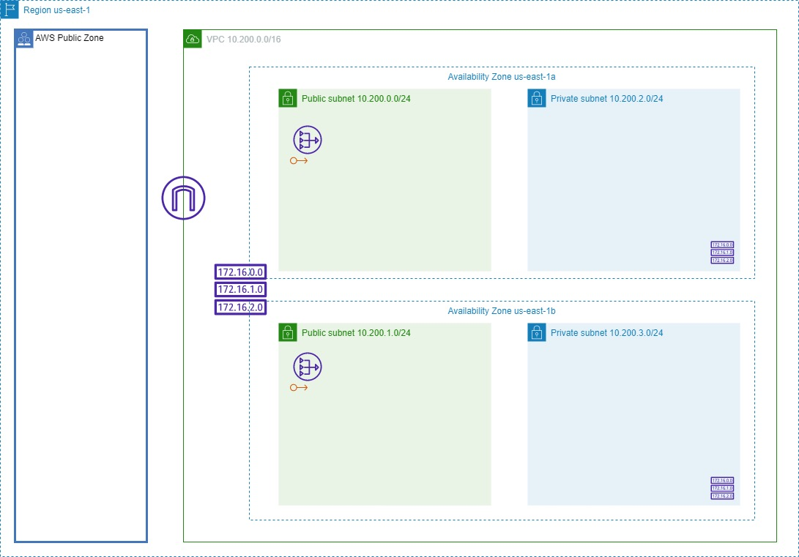

# Base Infrastructure for AWS

    The above code is meant to use in the us-east-1 region.



# terraform-template

Terraform definition to bootstrap multi-environment projects focused on code
reutilization and best practices.

## Requirements

- Terraform (see [tfenv](https://github.com/tfutils/tfenv))
- AWS credentials
- make (Makefile)
- Ruby (Rakefile)

## Motivation

Terraform is a great tool for automating infrastructure but it has its
drawbacks:

- Hard to reuse code on different environments, regions, etc
- A module version cannot be parametrized on the `source` definition

Some of this problems are solved in the Enterprise version so we should
keep an eye on it.
This template contains the learned leassons we had implementing
solutions on different projects at scale.
The main objective of the template is to stay as close as possible to
Terraform avoiding custom wrappers that are difficult to mantain.

How about workspaces? Hashicorp does not recommend workspaces for
[modelling different
environments](https://www.terraform.io/docs/state/workspaces.html#when-to-use-multiple-workspaces).

It is always possible to improve what we have indeed there are plenty of
Open Source tools out there, to name a few:

- [Terragrunt](https://github.com/gruntwork-io/terragrunt)
- [Geodesic](https://github.com/cloudposse/geodesic)

Learn from their accerts, mistakes and avoid reinventing the wheel.

## Getting Started

This repository should be the starting point for new projects. This is
a template and contains a set of examples that can be extended for
your implementation.

1. Clone this repository and create a new one based on this code
2. Choose the environment you want to start working with: `prd`
3. Export the `AWS_PROFILE` with your AWS temporary credentials
4. Fetch external modules defined in the Terrafile: `make get ENV=prd`
5. Initialize the environment: `make init ENV=prd`.
   This step downloads the dependencies, Terraform providers and
   initialize the Terraform configuration.
6. Update the environment configuration variables:
   `environments/prd/production.auto.tfvars`.
   In this step you need to update the VPC CIDR block and the project name.
7. Create an EC2 key-pair and configure the name of the key if you plan
   to use some EC2 instance. Then update the environment variables with
   this key name.
8. Apply base resources for the environment: `make apply ENV=prd`
   This step creates the S3 bucket were the tfstate is stored.
9. Update and uncomment S3 backend configuration for the environment in `environments/prd/terraform.tf`
10. Initialize Terraform with new backend config: `make init ENV=prd`

At this point you should have:

- Terraform configured with a remote S3 backend (tfstate in S3 and DynamoDB locking)
- Route 53 internal zone
- Standard VPC configuration with R53 association

## Layout

The logic is split in 3 files:

- `Makefile`: manages the mapping with Terraform commands
- `Rakefile`: manages the parsing of the Terrafile to clone modules
- `utils/aws_utils.sh`: manages symlinks for every environment

The code can be structured in 3 different directories:

- `environments/${env}/`: logic for the specific environment
- `common/`: this logic is reused across all the environments
- `reusables/`: this logic can be included in an environment if it is explicitly defined

Each environment is a separated and isolated installation and has its
own Terraform state file.

- Module dependencies are managed per environment in each Terrafile, dependencies are resolved recursively for each module defined. Each module should have it's own Terrafile with the necessary dependencies defined for it to work as a standalone module. Having a Terrafile is not mandatory for any module, but if a module defines any dependencies in it's Terrafile, those will be resolved recursively inside the modules directory in a newly created `modules` dir, thus you may find the following directory structure when using modules with dependencies:

```
__ reusables
__ common
__ environments
	|__ dev
		 |__ modules
		 		|__ <some-module>
		 		|__ <some-module-with-own-dependencies>
				|		|__ Terrafile
				|		|__ modules
				|		|__ <other-module>
				|			|__ <some-other-module-with-own-dependencies>
				|			|		|__ Terrafile
				|			|		|__ modules
				|			|				|__ <yet-another-module>
				|			|					 |__ Terrafile
				|			|					 |__ modules # the pattern goes on
				|			|				|__ <yet-another-module>
				|			|__ <other-module>
		 		|__ <some-module>
```

- This forces modules to reference any dependant module's source by using a relative path of `./modules/<module-name>`.

- Code reutilization is achieved by symlinks

### Variables

As the code is shared across environments or installations you must take
this into account when you add or update code. You should use variables
to avoid hardcoding the environment name in the code. Each environment
has a `${environment}.auto.tfvars` definition were you can set custom
variables for the environment.

### Reusables

Sometimes you need to reuse some definitions but only in a set of
environments. This is the use case were you would use reusables.

To use the reusables logic create a `.reusables` file in you environment
definition `environments/${env}/.reusables`. This file should contain
the name of a Terraform file defined in the `reusables` directory.

Lets say you need to setup an ECS cluster only in `dev` and `prd` but
not in `qa`. The definition of this cluster must be in a file inside
`reusables` directory, `reusables/ecs_cluster.tf`.

```bash
for e in "dev prd"; do
  echo "ecs_cluster.tf" >> environments/$e/.reusables"
done
```

At this point you should run `make get ENV=prd` and `make get ENV=dev`
to recreate the symlinks for the environments and you are ready to apply
to create the cluster.

## Usage

Terraform commands can be run either using the Makefile abstraction or
terraform. The main difference is where you run the command from. Make
commands are run from the root directory and terraform commands are run
from the environment directory.

The only required command to be run using the Makefile is the `make get`
that creates the symlinks and downloads the modules. This command should
be executed only when the Terrafile is updated or when a new file is
added either to the `common` or `reusables` directory.

These are the parameters that Terraform receives and the supported
commands using the Makefile:

```bash
grep TF_VARS Makefile
	$(TF_VARS) $(TF_BIN) get
	$(TF_VARS) $(TF_BIN) plan $(TF_ARGS)
	$(TF_VARS) $(TF_BIN) apply $(TF_ARGS)
	$(TF_VARS) $(TF_BIN) refresh $(TF_ARGS)
	$(TF_VARS) $(TF_BIN) destroy $(TF_ARGS)
	$(TF_VARS) $(TF_BIN) init
	$(TF_VARS) $(TF_BIN) state push errored.tfstate
	$(TF_VARS) $(TF_BIN) show
	$(TF_VARS) $(TF_BIN) output $(OUTPUT)
	$(TF_VARS) $(TF_BIN) import $(RESOURCE_NAME) $(RESOURCE_ID)
```

### Using make

```bash
make get ENV=prd
make apply ENV=prd
```

### Using terraform

```bash
make get ENV=prd
cd environments/prd/
terraform apply
```

## Package modules

The directory `environments/*/modules` is not included in the `.gitignore`
intentionally. This allows us to pack all the module dependencies in the
repo within the code. Running a `make get ENV=prd` will download all the
modules in the `prd` environment.
To be able to add all these modules to the repository the reference to
Git must be deleted.

```bash
find environments/prd/modules -type d -name ".git" -exec rm -rf {} \;
```
